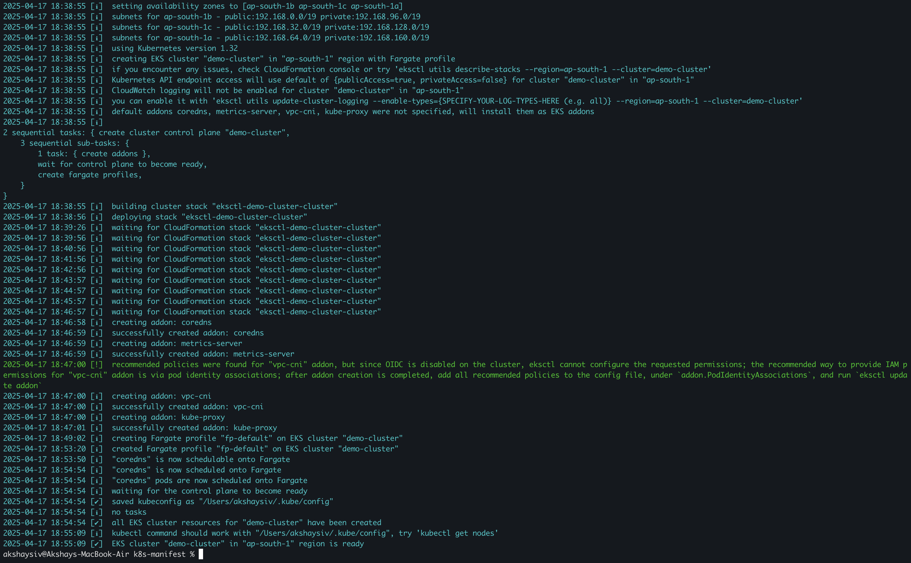

# aws-eks-project

In this example, we are going to deploy a sample Nginx application in EKS. This guide will walk you through the steps to create an EKS cluster, configure it for Fargate, deploy the Nginx application, and access it via an Application Load Balancer (ALB).

## Creating an EKS Cluster

Most organizations prefer using the `eksctl` command-line tool to create an EKS cluster instead of using the AWS Management Console. Below is an example of how to create a cluster using `eksctl`:

```bash
eksctl create cluster --name demo-cluster --region ap-south-1 --fargate
```


You can also verify if the cluster is created by navigating to the **AWS Management Console**. Go to the **EKS** service and check if the cluster named `demo-cluster` is listed under the **Clusters** section.


> **Note:** The cluster creation process typically takes around 10-15 minutes to complete. Please be patient while the resources are being provisioned.

### Creating a Fargate Profile

To run workloads on AWS Fargate, we need to create a Fargate profile. 

```bash
eksctl create fargateprofile \
    --cluster demo-cluster \
    --region ap-south-1 \
    --name nginx-app \
    --namespace nginx
```

OUTPUT :

```
akshaysiv@Akshays-MacBook-Air k8s-manifest % eksctl create fargateprofile \
    --cluster demo-cluster \
    --region ap-south-1 \
    --name nginx-app \
    --namespace nginx
2025-04-17 19:07:48 [ℹ]  creating Fargate profile "nginx-app" on EKS cluster "demo-cluster"
2025-04-17 19:08:05 [ℹ]  created Fargate profile "nginx-app" on EKS cluster "demo-cluster"
```

You can check the AWS Management Console to verify if the Fargate profile is listed under the **Fargate profiles** section of your EKS cluster. Navigate to the **EKS** service, select your cluster (`demo-cluster`), and then go to the **Fargate profiles** tab.


### Deploying the Nginx Application

Once the Fargate profile is created, you can deploy your Nginx application using the Kubernetes manifest files. Run the following command:

```bash
kubectl apply -f k8s-manifest/deployment.yaml
kubectl apply -f k8s-manifest/service.yaml
kubectl apply -f k8s-manifest/ingress.yaml
```

This will create the necessary Kubernetes resources for Nginx application. we can verify the status of the pods by running:

```bash
kubectl get pods -n nginx
```

You should see the pods in a `Running` state.


```bash
akshaysiv@Akshays-MacBook-Air k8s-manifest % kubectl get ingress -n nginx
NAME      CLASS   HOSTS   ADDRESS   PORTS   AGE
ingress   alb     *                 80      62s
```

The `ADDRESS` field in the output of `kubectl get ingress -n nginx` will remain empty if there is no ingress controller deployed in the cluster to process the ingress resource and create the corresponding Application Load Balancer (ALB) or other load balancer.

To fix this, you need to ensure that an ingress controller is installed and running in your Kubernetes cluster. For example, if you're using AWS, you can deploy the AWS Load Balancer Controller, which is responsible for creating ALBs for ingress resources.

------

### Configuring IAM OIDC Provider

To enable the AWS Load Balancer Controller or other Kubernetes features that require IAM roles for service accounts, you need to associate an IAM OIDC provider with your EKS cluster. Run the following command:

```bash
eksctl utils associate-iam-oidc-provider --cluster demo-cluster --approve
```

This command associates the IAM OIDC provider with your EKS cluster, allowing Kubernetes service accounts to assume IAM roles.

> **Note:** Ensure that your IAM user or role has the necessary permissions to perform this operation.

```
eksctl utils associate-iam-oidc-provider --cluster demo-cluster --approve
```

### Installing AWS Load Balancer Controller Using Helm

To install the AWS Load Balancer Controller in your EKS cluster, use the following Helm command:

```bash
helm install aws-load-balancer-controller eks/aws-load-balancer-controller -n kube-system \
    --set clusterName=demo-cluster \
    --set serviceAccount.create=false \
    --set serviceAccount.name=aws-load-balancer-controller \
    --set region=ap-south-1 \
    --set vpcId=vpc-0cc3772b2b5ed7e63
```

This command installs the AWS Load Balancer Controller in the `kube-system` namespace. Ensure that the `clusterName`, `region`, and `vpcId` values match your EKS cluster configuration.

You can verify the deployment status by running:

```bash
kubectl get deployments -n kube-system aws-load-balancer-controller
```

The output should indicate that the deployment is ready:

```bash
NAME                           READY   UP-TO-DATE   AVAILABLE   AGE
aws-load-balancer-controller   2/2     2            2           2m12s
```

Once the AWS Load Balancer Controller is installed, it will process ingress resources and create the corresponding Application Load Balancer (ALB) or other load balancers as needed.

```bash
akshaysiv@Akshays-MacBook-Air k8s-manifest % kubectl get ingress -n nginx
NAME      CLASS   HOSTS   ADDRESS                                                               PORTS   AGE
ingress   alb     *       k8s-nginx-ingress-dfe95cd60e-252864626.ap-south-1.elb.amazonaws.com   80      29m
```


### Accessing the Application

Once the Application Load Balancer (ALB) is created, you can access your application using the ALB URL. Open your browser and navigate to the `ADDRESS` value displayed in the output of the `kubectl get ingress -n nginx` command.


```
http://k8s-nginx-ingress-dfe95cd60e-252864626.ap-south-1.elb.amazonaws.com
```

You should see the Nginx welcome page or your custom application page if configured correctly.

> **Note:** Ensure that your security groups and network configurations allow inbound traffic to the ALB on the required ports.

